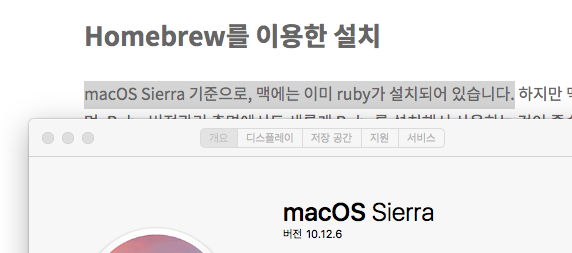

## 왜만드냐?

- 개발자라면 기술블로그를 가져야하지 않을까 막연하게 생각해왔다.
- 나는 항상 문서를 읽으면, 빠르게 구현하고 싶은 욕심에 핵심만 보느라 이론의 깊이가 많이 얕은 편이다
- 그것을 보강하기 위해서라도 기술블로그는 필요하다
- 다행히게도 요즘 이론공부하는게 재밌다.


## 뭘로 만드냐

여러가지 플랫폼을 비교해본 결과 나는 아래 조건을 만족해야 할것같았다

- 읽기 쉬워야한다
- 깔끔한 디자인
- 글찾기가 쉬워야함
- 마크다운으로 작성 가능해야한다.
- 블로그에 대한 모든 데이터가 나에게 소유되어야 한다.

좀 더 여러가지 이유가 있었던것 같은데 이 카테고리는 그런 세세한걸 쓰는 곳이 아니니까 패스하고,

Jekyll로 블로그를 만들어서 Github.io로 배포하기로 했다.


## 시작해봤다.

또또 나의 안좋은습관, 제대로 자료를 찾지않고 바로 개발에 착수했다.
이것은 나중에 따로 조사해서 howto에 올릴것이다.

지킬은 ruby기반의 정적 사이트 생성기인듯하다.

- 테마고 뭐고 깃허브에 바로 포스팅과 레이아웃파일들을 올려서 작업하려니, 많은 오류가 났다.
  - github에 올리자마자 바로 업데이트되는것이 아니다.
  - 만약 새로 올린 layout이나, 구조파일들에 문제가 있을시 가장 최근의 정상파일로 ```username.github.io```가 생성된다.
  - 때문에 약간의 값을 수정한것을 확인하거나, 포스트를 올리기전에 확인하는 작업이 불편하다.

- 이를 해결하기 위해 로컬에서 서버를 돌려 어떻게 페이지가 나오는지를 보고, 괜찮겠다 싶을때만 git저장소에 올려서 홈페이지를 릴리즈 해야겠다고 생각했다.


---

먼저 로컬환경에서 jekyll을 구동하기 위해서는 ruby가 필요하다

1. ```apt```로 루비를 설치하려 했으나 복잡해보여서 빠르게 꼬리를 말았다
2. 루비만 깔면 되잖아? 맥의 영원한 친구 ```HomeBrew```를 설치했다.
3. 왜냐하면 나는 이 블로그 시작하면서 모두 포멧했거든 이 노트북은 아주 순결한 상태였다
4. ```HomeBrew```를 설치하려면 또 ```Xcode```도 필요하다고했다. ```y```만 누르면 되는 일이기에 알아서 잘 깔았다
5. ```HomeBrew cask```도 깔았다. 엄청 오래걸렸다.
6. 이제 ```HomeBrew```를 써서 내가 깔고 싶은게 있다면 ```brew search [찾는것]```하면 된다
7. 이상하다. ```brew search ruby```했는데 ```cask```리스트에 뜨지 않는다
8. 이게 다 헛짓거리였다. 나는 루비가 있다. 어쩐지  ruby인식을 하더라.



- ```HomeBrew```를 설치했으니 됐어! 언젠가 또 쓰겠지! 한번 날잡아서 정리하지뭐! 히히!


## 이제 Jekyll과 Bundler를 설치하자!

```terminal
sudo gem install jekyll bundler
```

위 명령줄을 terminal에 입력하면 모든게 끝날줄 알았다. 하지만 세상은 순탄치 않았고 나는 또 길고긴 에러문과 마주했다.


```
hyoyaui-Air:~ hyoya$ sudo gem install jekyll bundler
Password:
ERROR:  Could not find a valid gem 'jekyll' (>= 0), here is why:
          Unable to download data from https://rubygems.org/ - SSL_connect returned=1 errno=0 state=SSLv2/v3 read server hello A: tlsv1 alert protocol version (https://rubygems.org/latest_specs.4.8.gz)
ERROR:  Could not find a valid gem 'bundler' (>= 0), here is why:
          Unable to download data from https://rubygems.org/ - SSL_connect returned=1 errno=0 state=SSLv2/v3 read server hello A: tlsv1 alert protocol version (https://rubygems.org/latest_specs.4.8.gz)
```

일단 ```jekyll```과 ```bundler```둘 다 설치를 각각 시도했을때 각각 에러문을 리턴한거같다.

보통 에러문이 나오면 핵심줄을 구글에 바로 붙였을때, 어지간하면 모두 stackoverflow등에서 답이 나온다.

[첫 번 째 해결책](https://github.com/rubygems/rubygems/issues/2374)

> ```
> $ brew install ruby
> $ echo 'export PATH="/usr/local/opt/ruby/bin:$PATH"' >> ~/.bash_profile
> $ export LDFLAGS="-L/usr/local/opt/ruby/lib"
> $ export CPPFLAGS="-I/usr/local/opt/ruby/include"
> $ export PKG_CONFIG_PATH="/usr/local/opt/ruby/lib/pkgconfig"
> $ source ~/.bash_profile
> ```

- 나랑 똑같고, 똑같은 버전이고, 그래서 질문자가 말하는 업그레이드를 썼으나 

```
hyoyaui-Air:~ hyoya$ brew uninstall ruby
Error: No such keg: /usr/local/Cellar/ruby
```

- 세상은 시궁창이였다


[두 번째 해결책](https://github.com/jekyll/jekyll/issues/7274)

> ```
> echo '# Install Ruby Gems to ~/gems' >> ~/.bashrc
> echo 'export GEM_HOME=$HOME/gems' >> ~/.bashrc
> echo 'export PATH=$HOME/gems/bin:$PATH' >> ~/.bashrc
> source ~/.bashrc
> ```


- 드디어 해결했다.

```
sudo gem install jekyll bundler
```


## jekyll서버를 실행해보자!

```
jekyll serve
```

위 명령줄을 실행시 지킬 은 서버를 실행시켜야하는데 또 아래와같은 오류가 떴다.

```
hyoyaui-Air:hyoya.github.io hyoya$ jekyll serve
Traceback (most recent call last):
	10: from /Users/hyoya/gems/bin/jekyll:23:in `<main>'
	 9: from /Users/hyoya/gems/bin/jekyll:23:in `load'
	 8: from /usr/local/lib/ruby/gems/2.6.0/gems/jekyll-4.0.0/exe/jekyll:11:in `<top (required)>'
	 7: from /usr/local/lib/ruby/gems/2.6.0/gems/jekyll-4.0.0/lib/jekyll/plugin_manager.rb:52:in `require_from_bundler'
	 6: from /usr/local/lib/ruby/gems/2.6.0/gems/bundler-2.0.2/lib/bundler.rb:107:in `setup'
	 5: from /usr/local/lib/ruby/gems/2.6.0/gems/bundler-2.0.2/lib/bundler/runtime.rb:26:in `setup'
	 4: from /usr/local/lib/ruby/gems/2.6.0/gems/bundler-2.0.2/lib/bundler/runtime.rb:26:in `map'
	 3: from /usr/local/lib/ruby/gems/2.6.0/gems/bundler-2.0.2/lib/bundler/spec_set.rb:148:in `each'
	 2: from /usr/local/lib/ruby/gems/2.6.0/gems/bundler-2.0.2/lib/bundler/spec_set.rb:148:in `each'
	 1: from /usr/local/lib/ruby/gems/2.6.0/gems/bundler-2.0.2/lib/bundler/runtime.rb:31:in `block in setup'
/usr/local/lib/ruby/gems/2.6.0/gems/bundler-2.0.2/lib/bundler/runtime.rb:319:in `check_for_activated_spec!': You have already activated i18n 1.7.0, but your Gemfile requires i18n 0.9.5. Prepending `bundle exec` to your command may solve this. (Gem::LoadError)
```

[해결책](https://codechacha.com/ko/jekyll-version-issue/)

내가 설치한 Jekyll version과 필요한 jekyll version이 달라서 나는 오류였고,
위 링크에서 설명한대로 해결했다.

```
$ gem install bundler
$ bundle install
$ bundle exec jekyll serve
```


## 테마를 설정해 볼까

나는 내 블로그가 이랬으면 좋겠다고 생각했다

- 사이드바에 카테고리가 있어서 글을 찾는게 어렵지 않도록
- 쓸데없는 메뉴는 없어야함
- 사이드바가 오른쪽에 있으면 좋을것 같지만 선택사항


가장 깔끔하고 가장 많은 블로그가 추천하는 ```minimal-mistake```을 사용해서 진행했다.


## 카테고리 만들기

- 나는 글들을 커다란 카테고리로 분류하고, 카테고리 내에는 시리즈가 있고, 시리즈 안에 상세 글들이 있으면 좋다고 생각했다.
- 때문에 가장 커다란 카테고리가 필요해서 지킬에서 말하는 카테고리 만드는 방법을 참고했다
- 공식문서에도 있지만, 좀 더 보기 편한것을 따르기로 했다.

[내가 보기 편한게 최고 아닌가](https://devyurim.github.io/development environment/github blog/2018/08/07/blog-6.html)


## 글꼴 커스텀

- 글꼴이 너무 크고 안예쁘다
- 바꿔야징
- [이거다!]([https://blastak.github.io/Jekyll-%EA%B8%B0%EB%B0%98-%EB%B8%94%EB%A1%9C%EA%B7%B8-%EB%8B%A4%EB%93%AC%EA%B8%B0-1-%ED%8F%B0%ED%8A%B8.html](https://blastak.github.io/Jekyll-기반-블로그-다듬기-1-폰트.html))


## 이제 할거

- 블로그 디자인
  - footer 색
  - 글씨 크기 줄이기
  - 글꼴 바꾸기
- 블로그 설정
  - 블로그 주소체계
- 글쓸거
  - Story
    - ssafy
    - 무선사업부
    - 왜 블로그를 쓰나
    - 대학생때 내가 했던것들
  - howto
    - 블로그 jerkyll, ruby, github
    - github쓰는방법