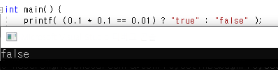
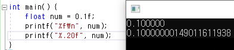

## 작성중

> 오늘 유튭을 보는데 흥미로운걸 발견했다.
> 0.1 * 0.1 == 0.01 을 출력했을때, false가 나오는것이다.
>
> 그 이유에 대해 삽질을 해본다

먼저 현상을 직접 눈으로 확인해보자

세상에 놀랍지 않은가

0.1은 0.1이 아니였다

왜 이런 현상이 일어났을까?

이유를 알기위해선 아래 내용을 알아야한다

1. 컴퓨터에서 데이터를 저장하는 방법
2. 컴퓨터에서 실수형 데이터를 저장하는 방법
3. 단일정밀도

