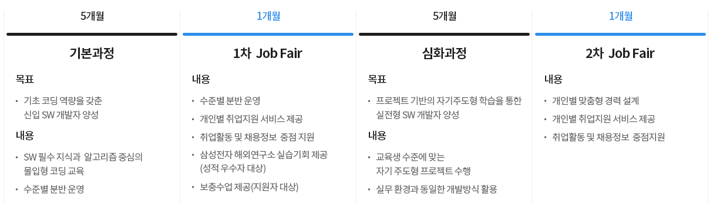

> SAMSUNG SOFTWARE ACADEMY FOR YOUTH

- 교육의 상세한 내용이나 정확한 과정은 보안서약때문에 작성할 수 없다
- 최대한 쓸 수 있는만큼 쓰려고 한다

## SSAFY?

> *삼성 청년 SW 아카데미(SSAFY)***는** **삼성의 SW 교육 경험과**
> **고용노동부의 취업지원 노하우를 바탕으로 취업 준비생에게 SW 역량 향상 교육 및**
> **다양한 취업지원 서비스를 제공하여 취업에 성공하도록 돕는 프로그램입니다.** [SSAFY공식홈페이지](https://www.ssafy.com/ksp/jsp/swp/swpMain.jsp)

삼성 청년 소프트웨어 아카데미 (Samsung Software Academy For Youth)

삼성전자가 주관하고 고용노동부가 후원하는 1년동안 소프트웨어 코딩과정과 프로젝트 과정을 통해 소프트웨어 전사를 키우는 과정이다.

소프트웨어 전공자도, 비전공자도 지원할 수 있고 맞춤형 강의가 제공되며 무엇보다도 교육 지원금 월 100만원씩 나온다는점이 취준생들에게 매력적이다

## 1기로 들어가기 까지

사실 나는 SSAFY 1기 서류 마감날 점심즘에 SSAFY라는것을 알았다.

자소서 쓰기도 빠듯한 시간이였기 때문에 공채때 준비했던 내 이력서를 보면서 스펙을 나열했고 자소서도 4시간만에 후딱 썼다. 지금 다시 내 자소서를 보면 아주 급하게 쓴게 보인다. 그전에 설명회같은것도 많았다고 하는데 나는 당일 알아버려서 하나도 못들었다.

- 서류는 11월 2일에 마감했고, 온라인 테스트 날짜는 편한날을 고를 수 있었다.

문제는 총 2파트로 나왔는데 NCS비슷한 문제풀기와 알고리즘적 문제가 나왔었다.

- 인터뷰에는 풀었던 알고리즘에 대해서, 그 현장에서 제시한 문제를 내가 생각한 솔루션에 대해서, 자소서의 내용에 따라 크게 세가지를 물어봤었다.

그리고 결과가 빠르게 나고, 바로 교육에 입과하여 SSAFY생활이 시작되었다.

문제는 너무 빠르게 진행되어서 당시 4학년이였는데 학교 수업때문에 12/8일 집보러 올라가서 12/9이사를 하고 12/10 첫출근을 했던게 너무 정신없었던것같다.

다행히 2기~ 부터는 여유롭게 시간을 주고 준비할 수 있는것 같다.

- 첫 교육 지원금은 첫달에 지급되지 않는다

나는 내가 살던 지역이 아니라서 자취방이 필요했는데 첫 교육 지원금이 나오지 않아서 조금 곤란했었다.

---

대학생때는 9시부터 6시까지 수업을 듣는다고 하면 미친놈 취급을 받았지만 SSAFY에서는 일상이다.

우리가 고등학생이다가 SSAFY에 들어왔으면 껌인 스케쥴이지만, 4학년이던 대학생에게 9 to 6스케쥴은 너무 가혹한것이었다.

겨울에 시작했기때문에 날이 깜깜할때 출근해서 더 깜깜해지면 퇴근했었다.

## 코딩 과정

<pre style="border: dotted 3px #777;
    padding: 18px;
    background: #b8c5c0;
    margin: 20px;
    color: #5f5f5f;
    border-radius: 26px;">
이것은 내 생각이다 
멋지다 
장하다
크으으으으으</pre>

<button onclick="test()" style="padding:10px; border-radius:10px; background:yellow;">btn</button>